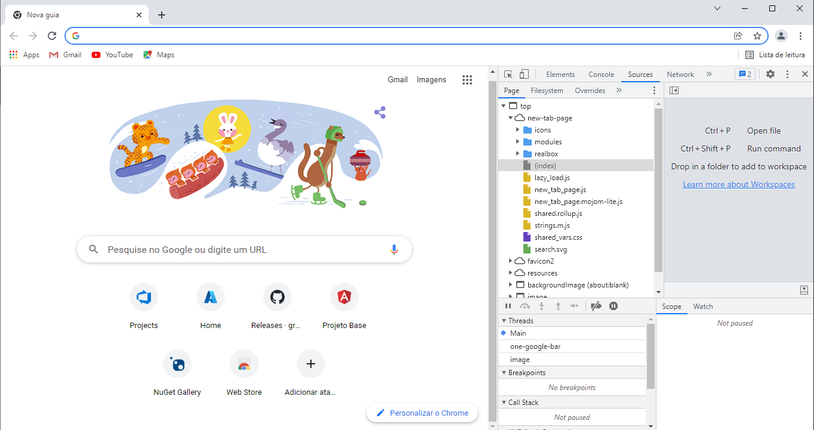

# Hands-On Chrome DevTools

Hands-On sobre as ferramentas para o desenvolvedor no Chrome

### Chrome DevTools

Para abrir o Chrome DevTools pressione a tela de função F12.

Vamos utilizar o Chrome para realizar o hands-on, mas grande parte dos recursos também estão disponíveis no Edge.

Próximo: [Atividade 01](docs/01-atividade.md)